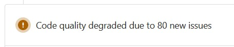

License Scanning is often considered part of Software Composition Analysis (SCA). SCA can contain aspects of inspecting the items your code uses. Open source software licenses define how you can use, modify and distribute the open source software. Thus, when selecting an open source package to merge to your code it is imperative to understand the types of licenses and the user restrictions the package falls under, which helps you mitigate any compliance issues. 

This config template can be included in your `.gitlab-ci.yml` to get the scanning job for free (similar to how the gitlab container scanning thing works).

## Setup Instructions
At the very top of your .gitlab-ci.yml either add or expand the `include:` section so it looks similar to this:  
```yaml
include:
  - remote: https://raw.githubusercontent.com/ambient-innovation/gitlab-trivy-license-checks/main/license-checks.yaml
  # There might be more includes here, usually starting with template like the following:
  # - template: 'Workflows/Branch-Pipelines.gitlab-ci.yml'
```

You will also need to have at least one stage called test in your top-level stages config for the default configuration:  
```yaml
stages:
  - prebuild
  - build
  - test
  - posttest
  - deploy
```  
**The `test` stage has to come after the docker image has already been built and pushed to the registry or the scanner will not work.**

Last but not least you need a job within that test stage going by the name `license_scanning`. A minimal config looks like this:  
```yaml
license_scanning:
  variables:
    IMAGE: $IMAGE_TAG_BACKEND
```

The example shown here will overwrite the `license_scanning` job from the template and tell it to

a) scan an image as specified in the `IMAGE_TAG_BACKEND` variable,\
b) perform a simple license scan\
c) only report errors with a level of HIGH,CRITICAL or UNKNOWN. 

You can also specify the `FILENAME` of the result-output as you like. 

**Note:** If you wish to run the `license_scanning` job in another job than "`test`" (as it does by default) simply copy the above code to your .gitlab-ci.yml file and add the keyword `stage` with your custom stage name.

Example for minimal stage-overwrite setup:

```yaml
license_scanning:
  stage: my-custom-stage
```

## Scanning multiple images/directories (i.e. frontend and backend)  
To scan multiple images/directories, you can simply copy the job above, add another key `extends: license_scanning` and change the variable values for the other container.

Here's an example:
```yaml
license_scanning_frontend:
  extends:
    - license_scanning
  variables:
    IMAGE: $IMAGE_TAG_FRONTEND
```

## Unknown licenses detected / licenses mismatched
Trivy compares the license names it finds to a static list of names contained in it's binary distribution. It's very likely that not all your dependencies will match against this list due to typos, different spellings or dual-licensing. In these cases you will have to create your own custom mapping in a config file called trivy.yaml.

To get you started, this repository ships with it's own trivy.yaml where we already matched a few common misspellings of license names into their corresponding categories. Unless specified otherwise, this scanner job will download the trivy.yaml and use that. We'd like to encourage you to submit new license mappings as PRs to this repository.

We will however not adjust the severity of individual licenses in this repository. If your project allows for strong-copyleft-licenses to be used or requires that you can't disclose library authors to your users for example, you will have to edit the trivy.yaml in your own repository.
You can download our main-copy and store it somewhere in your project source to modify it. Then point the license scanner at your personal config file using the TRIVY_YAML environment variable.

Here's an example:
```yaml
license_scanning:
  variables:
    TRIVY_YAML: './frontend/custom-trivy.yaml'
```

## Show reports in the Merge-Request UI
To show a report-widget with all the errors found in the Merge-Request widget, you need to a) set `allow_failure: true` in your scanning jobs and b) create another job to run in one of the following stages (can be an own stage or you can reuse one of your existing stages).  
This secondary job will then read the report files from your scanning jobs, combine them and report them as code-quality to GitLab.  
If you're already using the ambient-innovation/gitlab-trivy-security-checks scanner, you should combine all jobs in one result job.


Here's an example of how that job could look like:  
```yaml
check security scan results:
  stage: posttest
  image: ${CI_DEPENDENCY_PROXY_GROUP_IMAGE_PREFIX}/alpine:latest
  dependencies:
    - license_scanning
    # List all your container scanning jobs here, one per line, i.e.:
    # - container_scanning_frontend
    # List all your license scanning jobs here, one per line, i.e.:
    # - license_scanning_frontend
  tags:
    - low-load
  before_script:
    - apk update && apk add jq coreutils grep
  script:
    - echo "Step 1 - Merge all codeclimate reports from scanning jobs"
    - jq -s 'add' gl-codeclimate-*.json > gl-codeclimate.json
    - echo "Step 2 - Check if there were any vulnerabilities and exit with a status code equal to the number of vulnerabilities"
    - jq '.[].type' .\gl-codeclimate.json | grep "issue" | exit $(wc -l)
  # Enables https://docs.gitlab.com/ee/user/application_security/container_scanning/ (Container Scanning report is available on GitLab EE Ultimate or GitLab.com Gold)
  artifacts:
    paths:
      - gl-codeclimate.json
    reports:
      codequality: gl-codeclimate.json
```

If all is good, you'll see a new green bar above your test results.  
If any vulnerabilities were found, you'll see a new yellow bar above the test results in your Merge-Request:  
  
You can then expand that section and see all the results:  
  


You can also just check the failed scanning jobs for a plaintext error report. This can also include additional details not visible in the GitLab-UI.  
Currently trivy has no way to exclude operating system packages from the plaintext report, so this output will contain false-positive reports for those.  
Just scroll past the first table and only check the one that says Node.js, Python or whatever the programming language used for your project might be.

## Advanced Settings  
The container scanning job exposes a few more variables by which you can adjust the scanning if needed. The default settings are the recommendation of the TE-Circle, though.  

### Change minimum severity reported
By adding a new variable called `SEVERITY` to your job, you can change which severity items should be reported. The default is to report UNKNOWN, HIGH and CRITICAL licenses. The remaining options are: `LOW`, `MEDIUM`  
Trivy requires a full list of severities to report. To report all severities from MEDIUM and higher for example, you need to specify a comma-separated list like so: `SEVERITY: "MEDIUM,HIGH,CRITICAL,UNKNOWN"`

We recommend only scanning for licenses with a CRITICAL or UNKNOWN level in the backend as that is typically not considered to be distributed and licenses such as the GPL are perfectly fine to use without having to disclose the project sources to users. In frontend settings where users download your (minified) JavaScript, you should set the report level to include HIGH as well. Licenses such as the GPL would otherwise require to disclose the sourcecode to any user who requests it.

### Other settings
By default trivy performs one run in full-silence mode writing the results to the gitlab codeclimate report file and then another one showing the results in a plaintext table. If the scan is taking very long, you can also show a progress bar during the scan by setting the `TRIVY_NO_PROGRESS` variable to `"false"`.  
To make sure you're doing a fresh run and instruct trivy to download a fresh vulnerability database, you can turn off/move the cache directory via the `TRIVY_CACHE_DIR` variable. The default value for this variable is a directory called `.trivycache`

You can add more variables corresponding to the CLI switches as documented on the trivy homepage: https://aquasecurity.github.io/trivy/latest/docs/references/customization/envs/

This config ships with a default trivy.yaml that contains some additional license mappings for common misspellings of licenses. If you'd rather include your own mapping table, download the trivy.yaml file from this repository and store it in your git repository. You can then edit it and configure the Scanner to use your own file instead by providing the path to your trivy.yaml file in the TRIVY_YAML environment variable.

If you find missing license mappings, we would much appreciate it if you'd just add a PR to this repository with your changes or open an issue for assistance.
